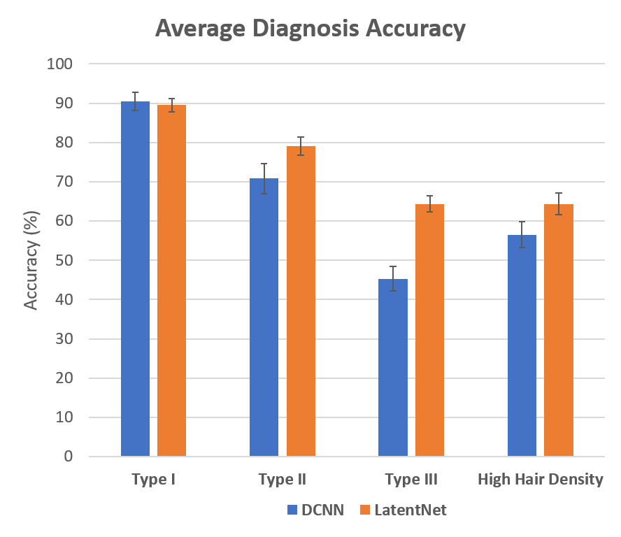
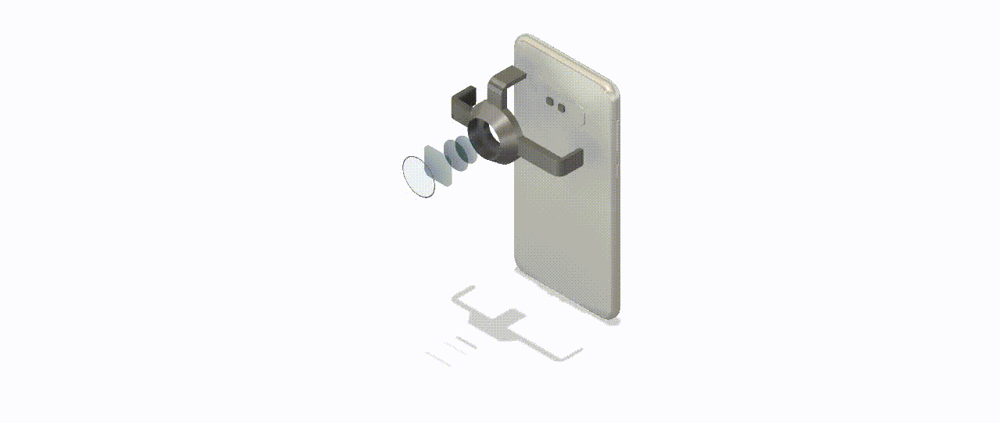

# 2021 International Science and Engineering Fair


Paper: [Automated Bias Reduction in Deep Learning Based Melanoma Diagnosis using a Semi-Supervised Algorithm](https://ieeexplore.ieee.org/abstract/document/9669772)

This repo contains code for the International Science and Engineering Fair hosted by Regeneron from May 16-21, 2021.
The main idea of the project is to be able to address racial and other
inherent forms of bias in a dataset while creating a deep learning
based diagnosis for Melanoma. Model details can be found in the ```Training``` folder of this repository. Full detail is in the paper. 

**Results**

As you can see from the diagram, my proposed LatentNet successfully
outperforms the conventional DCNN in 3 out of the 4 tested categories.



 
<p style="text-align:center;">
</p>


