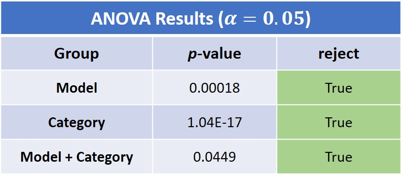
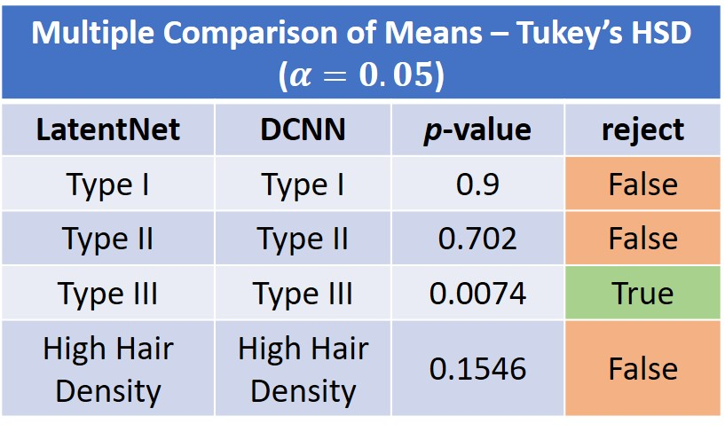

# Statistical Analysis

Two statistical tests were used to compare the LatentNet with the
DCNN. The accuracies and AUC scores for ten runs were collected and 
stored in the ```Data.xlsx``` file along with graphs containing average results.

The ```data.csv``` file contains the same data except it is formatted
to be compatible with the ```statsmodel``` API. 

First, a 2-way ANOVA with 10 repititions was conducted for preliminary
comparison between the models. Results are organized in the table below.




<!--  -->

Due to the significant ```Model+Category``` term in the ANOVA, a 
Tukey's Honest Significance Difference (HSD) post-hoc test was conducted
for more detail. Full results are in the ```Statistical Analysis.ipynb```
file. The important results have been compressed into the table below.



<!--  -->