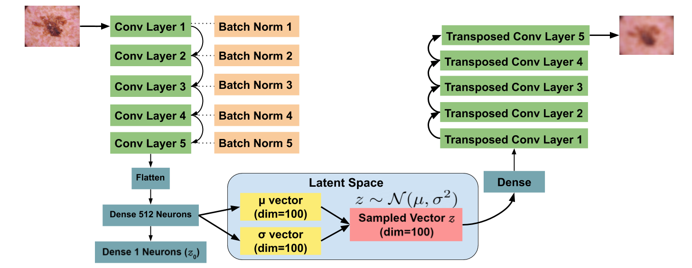

# Training & Testing

Before beginning the training process, I first undersampled images
from the original dataset due to the largely imbalanced data. As shown
in the ```Undersampling.ipynb``` file, the ```RandomUnderSampler```
from ```imblearn``` was used to efficiently accomplish this task.

After the data was stored in an h5 file, I began training both models.
In the ```DCNN+LatentNet.ipynb``` file, you can see two different 
models that are constructed. The first is a baseline Deep Convolutional
Neural Network or DCNN. 


The second model is the LatentNet. This model was a combination of the
DCNN and a Variational Autoencoder architecture to make debiasing plausible.
Same hyperparameters were used to train both models. 



*Libraries Used*

* [mitdeeplearning](https://github.com/aamini/introtodeeplearning/tree/master/mitdeeplearning)
* [TensorFlow](https://www.tensorflow.org/)
